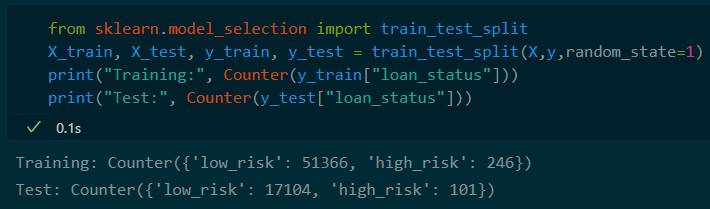
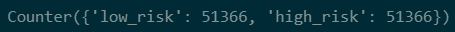

# Credit-Risk-Analysis

## Overview:
The goal of this investigation is to learn how to use `Machine Learning` statistical algorithms to create predictions based on given data patterns. We will use a free dataset from `LendingClub`, a peer-to-peer lending service provider, to analyse and predict credit risk in this challenge. Because the data includes a labelled outcome, this is referred to as `Supervised Learning`.
To finish this research, we train and assess the data with unbalanced classes using several Machine Learning approaches. Because the number of good loans outnumbers the number of dangerous loans, the LendingClub dataset presents an unbalanced categorization problem. To enhance the accuracy score by balancing the classifications and allowing for more relevant predictions, and improve the accuracy score. Thereby, applying various `Machine Learning` algorithms to resample the data. These algorithms include `RandomOverSampler`, `SMOTE`, `ClusterCentroids`, `SMOTEENN`, `BalancedRandomForestClassifier`, and `EasyEnsembleClassifier`.

## Results:
We use Machine Learning to resample the dataset using Python libraries: `scikit-learn` and `imbalanced-learn` analyse the outcomes and give a comparison for our research, as described in the overview.
In the first quarter of 2019, the original dataset includes 115,675 loan applications. To establish whether the application was considered "low" or "high" risk, we used the "loan status." The applications with "current" as the "loan status" were categorised as "low risk," while the rest were categorised as "high risk." This decreased the total number of applications to 68,817, with 99 percent of them being classed as "low risk."

The training set was divided into 51,366 "low risk" and 246 "high risk" applications using the 75/25 percent approach to partition the data for training vs. testing.

## Deliverable 1: Use Resampling Models to Predict Credit Risk

### Oversampling:

Until both categories are equal, the RandomOverSampler Model randomly selects from the minority class and adds it to the training set. The results divided 51,366 data into two categories: High Risk and Low Risk.

* Balanced accuracy score: 65.7%

* The "High Risk" precision rate was only 1% with the recall at 71% giving this model an F1 score of 2%.
* "Low Risk" had a precision rate of 100% and recall at 60%.

Like RandomOverSampler, the SMOTE (Synthetic Minority Oversampling Technique) Model increases the size of the minority class by creating new values depending on the value of the nearest neighbours to the minority class rather than random selection.

* Balanced accuracy score: 65.3%

* Like RandomOverSampler, the "High Risk" precision rate again was only 1% with the recall degraded to 61% giving this model an F1 score of 2%.
* "Low Risk" had a precision rate of 100% and an improved recall at 69%.

### Undersampling:

`ClusterCentroids` Model is an approach for generating synthetic data points that are indicative of clusters by identifying clusters of the majority class. The model divided 246 data into two categories: High Risk and Low Risk.

* Balanced accuracy score was lower than the oversampling models at 54.4%

* The "High Risk" precision rate again was only at 1% with the recall at 69% giving this model an F1 score of 1%.
* "Low Risk" had a precision rate of 100% and with a lower recall at 40% compared to the oversampling models.

## Deliverable 2: Use the SMOTEENN alogrithm to Predict Credit Risk

### Combination Sampling:

The `SMOTEENN (Synthetic Minority Oversampling Technique + Edited NearestNeighbors)` Model combines oversampling and undersampling techniques. The model assigned a High Risk rating to 68,458 records and a Low Risk rating to 62,022.

* The balanced accuracy score improved to 67.9% when using a combined sampling model.

* The "High Risk" precision rate did not improve was only 1%, however the recall increased to 80% giving this model an F1 score of 2%.
* "Low Risk" showed a precision rate of 100% with the recall at 56%.

## Deliverable 3: Use Ensemble Classifiers to Predict Credit Risk

Compare two new Machine Learning models for predicting credit risk that are less biassed. The models assigned 51,366 people to the High Risk category and 246 to the Low Risk category.

* The balanced accuracy score improved to 78.9% when using a combined sampling model.

* The "High Risk" precision rate increased to 3% with the recall at 70% giving this model an F1 score of 6%.
* "Low Risk" still had a precision rate of 100% with the recall at 87%.
* The top feature by importance was "total_rec_prncp" at 7.9% of the total.

The `EasyEnsembleClassifierModel` is a collection of classifiers that integrate individual decisions to classify fresh samples.

* The balanced accuracy score increased to 93.2% with this model.

* The "High Risk" precision rate increased to 9% with the recall at 94% giving this model an F1 score of 16%.
* "Low Risk" still had a precision rate of 100% with the recall now at 92%.

## Summary:

When all six models were compared, the `EasyEnsembleClassifer` model produced the best results, with a 93.2% accuracy rate and a 9% precision rate when identifying "High Risk candidates." In comparison to the other models, the sensitivity rate (also known as recall) was the greatest at 92 percent. With a sensitivity rate of 94 percent and an F1 score of 97%, the result for predicting "Low Risk" was also the best. As a result, if a model for performing this type of analysis were to be proposed, this would be the clear winner.

Ranking of models in descending order based on "High Risk" results:

* `EasyEnsembleClassifier`: 93.2% accuracy, 9% precision, 92% recall and 16% F1 Score.
* `BalancedRandomForestClassifier`: 78.9% accuracy, 3% precision, 70% recall and 6% F1 Score.
* `SMOTEENN`: 67.9% accuracy, 1% precision, 80% recall and 2% F1 Score.
* `RandomOverSampler`: 65.7% accuracy, 1% precision, 71% recall and 2% F1 Score.
* `SMOTE`: 65.3% accuracy, 1% precision, 61% recall and 2% F1 Score.
* `ClusterCentroids`: 54.4% accuracy, 1% precision, 69% recall and 1% F1 Score.

# Resources:

Dataset from LendingClub: [LoanStats_2019Q1](./Resources/LoanStats_2019Q1.csv)

Software: Python 3.7.11, VSCode 1.66.2 with Jupyter Extension 2022.3.1000901801
